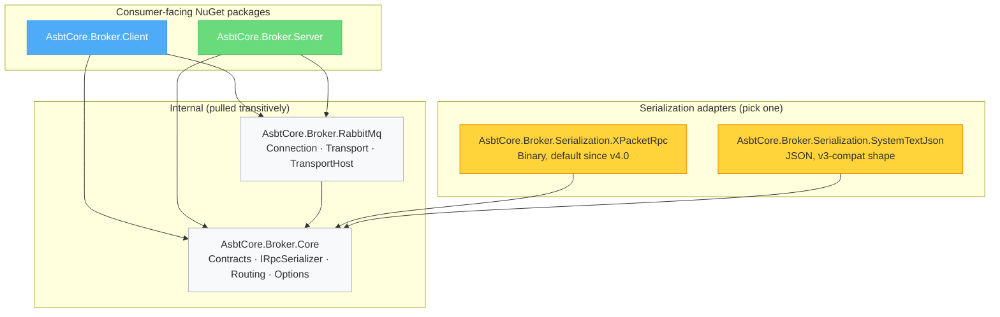
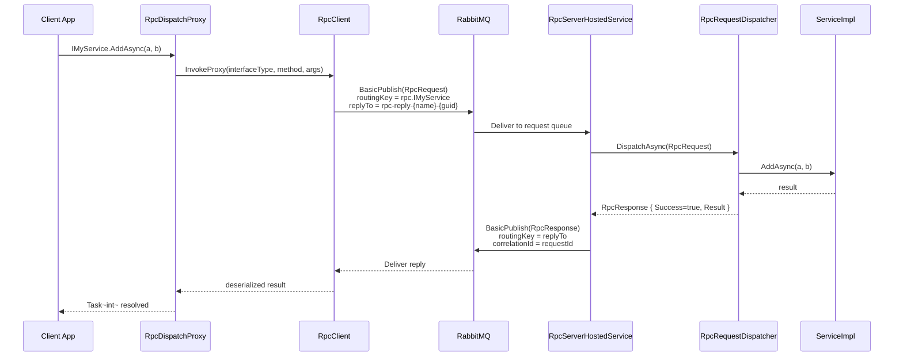
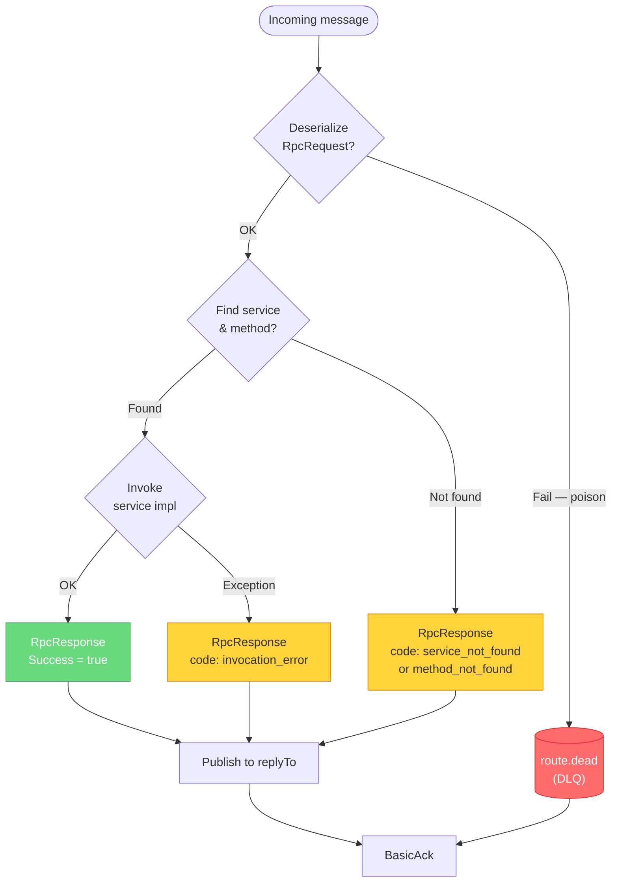
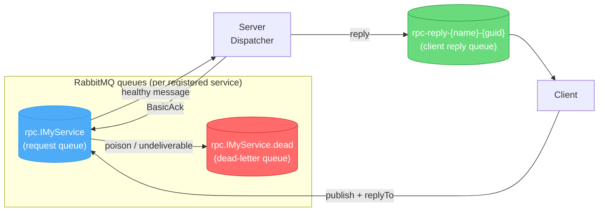
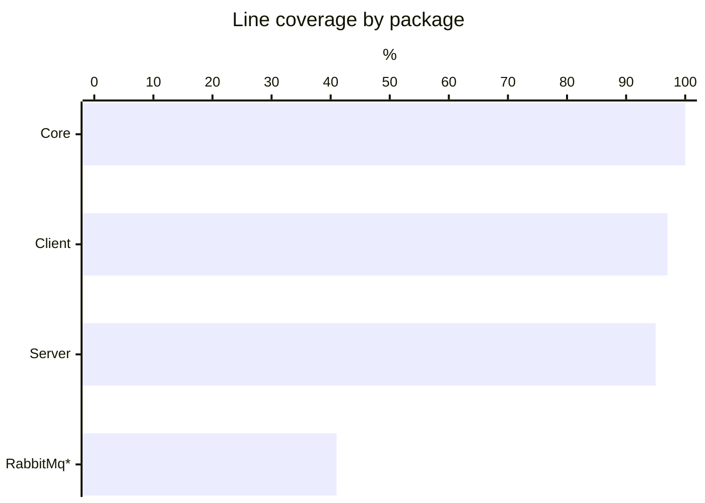
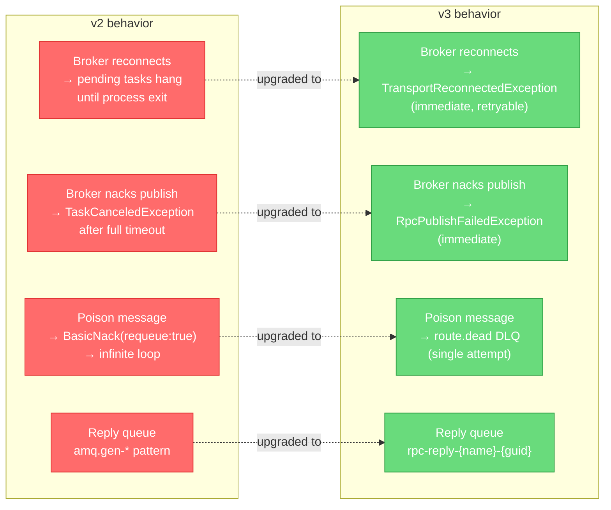

# AsbtCore.Broker — RabbitMQ RPC

[Русская версия](README.ru.md)

A lightweight RPC framework on top of RabbitMQ for .NET 10: type-safe contracts via C# interfaces, DI integration on client and server, JSON serialization, reply-queue pattern, publisher confirms, per-route dead-letter queues.

This repository ships two consumer-facing NuGet packages: **`AsbtCore.Broker.Client`** and **`AsbtCore.Broker.Server`**. Everything else (`Core`, `RabbitMq`) is pulled in transitively.

---

## Installation

**Client app** (calls remote services):

```bash
dotnet add package AsbtCore.Broker.Client
```

**Server app** (hosts implementations):

```bash
dotnet add package AsbtCore.Broker.Server
```

**Shared contracts project** — a plain class library with interfaces and DTOs, referenced by both sides. No `AsbtCore.Broker.*` reference needed there.

---

## Package structure



| Package | Contents |
|---|---|
| `AsbtCore.Broker.Core` | `RpcRequest/Response`, `IRpcTransport`, `IRpcSerializer`, `IRpcRouteResolver`, `RpcOptions`, `RpcRemoteException`, `StableTypeName` |
| `AsbtCore.Broker.RabbitMq` | `RabbitMqRpcTransport` (client-side), `RabbitMqRpcTransportHost` (server-side), `IRabbitMqConnectionProvider` |
| `AsbtCore.Broker.Client` | `RpcClient`, `RpcProxyFactory` (`DispatchProxy`), DI: `AddRabbitRpcClient` (returns `RpcClientBuilder`) / `RpcClientBuilder.AddProxy<T>()` |
| `AsbtCore.Broker.Server` | `RpcServerBuilder`, `RpcServerRegistry`, `RpcRequestDispatcher`, `RpcServerHostedService`, DI: `AddRabbitRpcServer` |
| `AsbtCore.Broker.Serialization.XPacketRpc` | `XPacketRpcSerializer` (binary), `UseXPacketRpcSerialization()` DI extension. **Default since v4.0.** |
| `AsbtCore.Broker.Serialization.SystemTextJson` | `JsonRpcSerializer`, `UseJsonRpcSerialization()` DI extension. Drop-in shape for v3 JSON wire. |

---

## Architecture

### RPC call flow



### Solution layout

```
RabbitMq.RPC/
├─ AsbtCore.Broker.Core/                            core contracts & IRpcSerializer
├─ AsbtCore.Broker.RabbitMq/                        RabbitMQ.Client transport layer
├─ AsbtCore.Broker.Client/                          proxy factory, RpcClientBuilder & DI
├─ AsbtCore.Broker.Server/                          dispatcher, registry, RpcServerBuilder
├─ AsbtCore.Broker.Serialization.XPacketRpc/        binary IRpcSerializer adapter (default)
├─ AsbtCore.Broker.Serialization.SystemTextJson/    JSON IRpcSerializer adapter (v3-compat)
└─ Tests/
   ├─ AsbtCore.Broker.Core.Tests/
   ├─ AsbtCore.Broker.ClientServer.Tests/
   ├─ AsbtCore.Broker.Serialization.SystemTextJson.Tests/
   └─ AsbtCore.Broker.Serialization.XPacketRpc.Tests/
```

---

## Configuration (`RpcOptions`, section `RabbitMqRpc`)

```json
{
  "RabbitMqRpc": {
    "HostName": "localhost",
    "Port": 5672,
    "VirtualHost": "/",
    "UserName": "guest",
    "Password": "guest",
    "ClientProvidedName": "my-app",
    "RoutePrefix": "rpc.",
    "PrefetchCount": 1,
    "DefaultTimeoutSeconds": 30
  }
}
```

---

## Usage

### 1. Shared contract

```csharp
// MyApp.Contracts.csproj — no broker dependencies
public interface ICalculatorService
{
    Task<int>     AddAsync(int a, int b);
    Task<UserDto> GetUserAsync(Guid id);
}

public sealed record UserDto(Guid Id, string Name);
```

### 2. Server

```csharp
// Program.cs (ASP.NET Core / Worker Service)
using AsbtCore.Broker.Server;
using AsbtCore.Broker.Serialization.XPacketRpc;

var builder = WebApplication.CreateBuilder(args);

builder.Services
    .AddRabbitRpcServer(builder.Configuration)
    .UseXPacketRpcSerialization()                   // <-- required since v4.0
    .Register<ICalculatorService, CalculatorService>();

var app = builder.Build();
app.Run();

public sealed class CalculatorService : ICalculatorService
{
    public Task<int>     AddAsync(int a, int b) => Task.FromResult(a + b);
    public Task<UserDto> GetUserAsync(Guid id)  => Task.FromResult(new UserDto(id, "Alice"));
}
```

> The DTOs (`UserDto`, etc.) must be reachable by the XPacketRpc source generator. In your
> contracts project, reference `XPacketRpc.Generators` as an analyzer and call
> `XPRpc.Touch<T>()` once per DTO from a `[ModuleInitializer]`. JSON users (the
> `.UseJsonRpcSerialization()` adapter) need none of that.

### 3. Client

```csharp
using AsbtCore.Broker.Client;
using AsbtCore.Broker.Serialization.XPacketRpc;

var builder = Host.CreateApplicationBuilder(args);

builder.Services
    .AddRabbitRpcClient(builder.Configuration)
    .UseXPacketRpcSerialization()                   // <-- required since v4.0
    .AddProxy<ICalculatorService>();                // <-- was AddRpcProxy<T> in v3

var host = builder.Build();

var calc = host.Services.GetRequiredService<ICalculatorService>();
var sum  = await calc.AddAsync(2, 3);               // → 5
var user = await calc.GetUserAsync(Guid.NewGuid()); // → UserDto
```

---

## Error handling



Server-side exceptions are serialized and rethrown on the client as `RpcRemoteException`:

```csharp
try
{
    var result = await calc.AddAsync(1, 2);
}
catch (RpcRemoteException ex)
{
    Console.WriteLine(ex.RemoteExceptionType); // e.g. "System.InvalidOperationException"
    Console.WriteLine(ex.RemoteCode);          // "invocation_error"
    Console.WriteLine(ex.RemoteDetails);       // server stack trace
}
catch (TaskCanceledException)
{
    // DefaultTimeoutSeconds exceeded
}
```

---

## Message reliability & DLQ

Each RPC route gets a companion durable dead-letter queue `{route}.dead`.



Poison messages (malformed payload, unresolvable type, internal dispatcher error) are moved to `*.dead` after a **single attempt** — no infinite requeue loops. Monitor `*.dead` queue depth for alerting.

---

## How to add a new RPC service

1. **Contract** — add interface (`Task` / `Task<T>` methods) + DTOs to the shared `*.Contracts` project.
2. **Server** — implement and register:
   ```csharp
   services.AddRabbitRpcServer(configuration)
           .UseXPacketRpcSerialization()
           .Register<IMyService, MyServiceImpl>();
   ```
3. **Client** — register a proxy:
   ```csharp
   services.AddRabbitRpcClient(configuration)
           .UseXPacketRpcSerialization()
           .AddProxy<IMyService>();
   ```
4. Both sides must use the same `RoutePrefix` and interface namespace. Routing key = `RoutePrefix + typeof(T).FullName`.

### Working with vendor DTOs (MemoryPack)

If your DTOs ship inside compiled libraries you cannot modify, the
`RabbitRpc.Serialization.MemoryPack` adapter supports them without any
`[MemoryPackable]` attribute. Lazy discovery is on by default.

For latency-sensitive paths use `PrewarmAssembly` / `PrewarmType` to amortize
the per-type build cost at startup.

For polymorphic base types you must register a union mapping explicitly —
MemoryPack cannot infer derived types from a base reference at runtime.

```csharp
services.AddRabbitRpcServer(configuration)
    .UseMemoryPackRpcSerialization(opt =>
    {
        opt.PrewarmAssembly(typeof(UserDto).Assembly);
        opt.RegisterUnion<Animal>(b => b
            .Add<Cat>(tag: 1)
            .Add<Dog>(tag: 2));
    });
```

Performance: reflection-built formatters are ~2-4x slower than native
`[MemoryPackable]` source-gen but still faster than JSON. AOT/trim
scenarios are not supported on this path — keep `[MemoryPackable]` for those.

---

## Testing

Tests use **TUnit** + **Moq** and run without a real RabbitMQ broker.

```bash
dotnet run --project Tests/AsbtCore.Broker.Core.Tests/AsbtCore.Broker.Core.Tests.csproj
dotnet run --project Tests/AsbtCore.Broker.ClientServer.Tests/AsbtCore.Broker.ClientServer.Tests.csproj
```

**83 tests** — 45 in `Core.Tests`, 38 in `ClientServer.Tests`.

Coverage (unit tests only, no real broker):



> \* RabbitMq transport classes (`RabbitMqRpcTransport`, `RabbitMqConnectionProvider`) require a live broker; remaining coverage is integration-test territory.

---

## Requirements

- .NET 10
- RabbitMQ 3.12+ / RabbitMQ.Client 7.x

---

## Migration v2 → v3

v3.0.0 is a reliability-focused release with **breaking wire and behavior changes**. v2.x and v3.x are **not interoperable** — upgrade clients and servers in lockstep.

### Wire-format change

Parameter and result type names on the wire now use the stable form `Namespace.TypeName, AssemblySimpleName`, dropping `Version`, `Culture`, and `PublicKeyToken`. Routine version bumps of contract assemblies no longer break the wire format.

A v2 client **cannot** talk to a v3 server (and vice versa) — the server's method-key lookup will fail with `method_not_found`.

### Behavior changes



### Operator action items

1. Upgrade client and server packages **in lockstep**.
2. Expect new queues `*.dead` per RPC route in your broker — set TTL/max-length policies as needed.
3. Add `catch (TransportReconnectedException)` and/or `catch (RpcPublishFailedException)` where proxy methods are awaited.
4. Update monitoring filters that matched the old `amq.gen-*` reply-queue pattern.

---

## Migration v3.0 → v3.1

- **Server-side message dispatch is now parallel by default.** `RpcOptions.ConsumerDispatchConcurrency` defaults to `PrefetchCount`. Existing handlers must be thread-safe. Set `RpcOptions.ConsumerDispatchConcurrency = 1` to retain the v3.0 sequential behavior.
- `IRpcTransportHost.StopAsync(CancellationToken)` was added as a default interface method. Custom transports should override it to drain in-flight handlers before disposal.
- `IRpcTransportHost.Dispose()` is now a sync-over-async last-resort path. Prefer `DisposeAsync()` (or let DI dispose the host).
- `RpcRequest.RequestId` is no longer auto-initialized in the property initializer. Client code that constructs `RpcRequest` directly must set `RequestId` explicitly.
- Poison reply handling: `OnResponseReceivedAsync` now surfaces deserialization errors to the awaiting caller instead of silently logging and waiting for the per-call timeout.

---

## Migration v3.1 → v4.0

v4.0 introduces a pluggable serialization layer and ships a binary wire format by default. **The wire format is incompatible with v3.x — roll forward client and server together.** Drain `rpc.*` queues to zero, or plan a downtime window before swapping deployments.

### What changed

1. **Wire format is binary by default.** v3.x clients cannot talk to v4 servers (and vice versa) regardless of adapter choice — the framing changed.
2. **A serialization adapter package is now required.** Install **one** of:
   - `RabbitRpc.Serialization.XPacketRpc` — binary, recommended for new and high-throughput deployments.
   - `RabbitRpc.Serialization.SystemTextJson` — JSON-on-the-wire (compatible shape with v3 payloads). Choose this when you cannot retire v3 producers/consumers immediately and need a faithful JSON behavior.
3. **A new DI call is mandatory.** Add `.UseXPacketRpcSerialization()` or `.UseJsonRpcSerialization()` to your builder. Startup throws `OptionsValidationException` if no `IRpcSerializer` is registered.
4. **`AddRabbitRpcClient(cfg)` returns `RpcClientBuilder`**, not `IServiceCollection`. Chain `.UseXPacketRpcSerialization()` then `.AddProxy<T>()` (the v3 `AddRpcProxy<T>()` extension was removed).
5. **Core types removed**: `AsbtCore.Broker.Core.Serialization.{JsonRpcSerializer, RpcJson, RpcSerializationHelper, AddRpcSerialization}`. They moved to the SystemTextJson adapter; the new namespace is `AsbtCore.Broker.Serialization.SystemTextJson`.
6. **`RpcRequest.Arguments[i].Payload`**: `JsonElement` → `ReadOnlyMemory<byte>`. Only affects code that builds `RpcRequest` directly (custom transports).
7. **`RpcResponse.Result`**: `JsonElement?` → `ReadOnlyMemory<byte>?`.
8. **`IRpcSerializer` widened** to four methods (`SerializeEnvelope` / `DeserializeEnvelope` over `RpcRequest`/`RpcResponse`, plus `SerializeFragment` / `DeserializeFragment` over per-arg payloads). Custom implementations must update.

### Before → after

```csharp
// v3.1
services.AddRpcSerialization<JsonRpcSerializer>();          // namespace AsbtCore.Broker.Core.Serialization (gone)
services.AddRabbitRpcClient(configuration)
        .AddRpcProxy<IMyService>();                         // returned IServiceCollection
```

```csharp
// v4.0 — binary (recommended)
services.AddRabbitRpcClient(configuration)                  // now returns RpcClientBuilder
        .UseXPacketRpcSerialization()
        .AddProxy<IMyService>();
```

```csharp
// v4.0 — JSON drop-in
services.AddRabbitRpcClient(configuration)
        .UseJsonRpcSerialization()
        .AddProxy<IMyService>();
```

### DTO setup for the XPacketRpc adapter

The binary adapter relies on a Roslyn source generator that emits per-DTO codecs at compile time. The generator only sees DTOs reachable from a `XPRpc.Touch<T>()` call site in the **same compilation** as the DTO. In your shared contracts project:

1. Reference the generator package as an analyzer:
   ```xml
   <ProjectReference Include="..\.external\XProtokol\XPacketRpc\XPacketRpc.csproj" />
   <ProjectReference Include="..\.external\XProtokol\XPacketRpc.Generators\XPacketRpc.Generators.csproj"
                     OutputItemType="Analyzer"
                     ReferenceOutputAssembly="false" />
   ```
2. Touch every DTO from a module initializer:
   ```csharp
   using System.Runtime.CompilerServices;
   using XPacketRpc;

   internal static class GeneratorTouchSites
   {
       [ModuleInitializer]
       internal static void TouchAll()
       {
           XPRpc.Touch<UserDto>();
           XPRpc.Touch<OrderDto>();
       }
   }
   ```

The JSON adapter has no equivalent step — `System.Text.Json` reflects DTOs at runtime.

### Operator action items

1. Upgrade client and server packages **in lockstep**. Drain queues or accept a downtime window.
2. Add the adapter `PackageReference` and the `.UseXPacketRpcSerialization()` / `.UseJsonRpcSerialization()` DI call to every entry point.
3. Rename `AddRpcProxy<T>()` to `.AddProxy<T>()` and ensure it chains off the builder returned by `AddRabbitRpcClient(cfg)`.
4. If you chose the XPacketRpc adapter, configure your contracts project per the snippet above.
5. Custom `IRpcSerializer` implementations must implement the new four-method surface; switch any `JsonElement` payload handling to `ReadOnlyMemory<byte>`.
