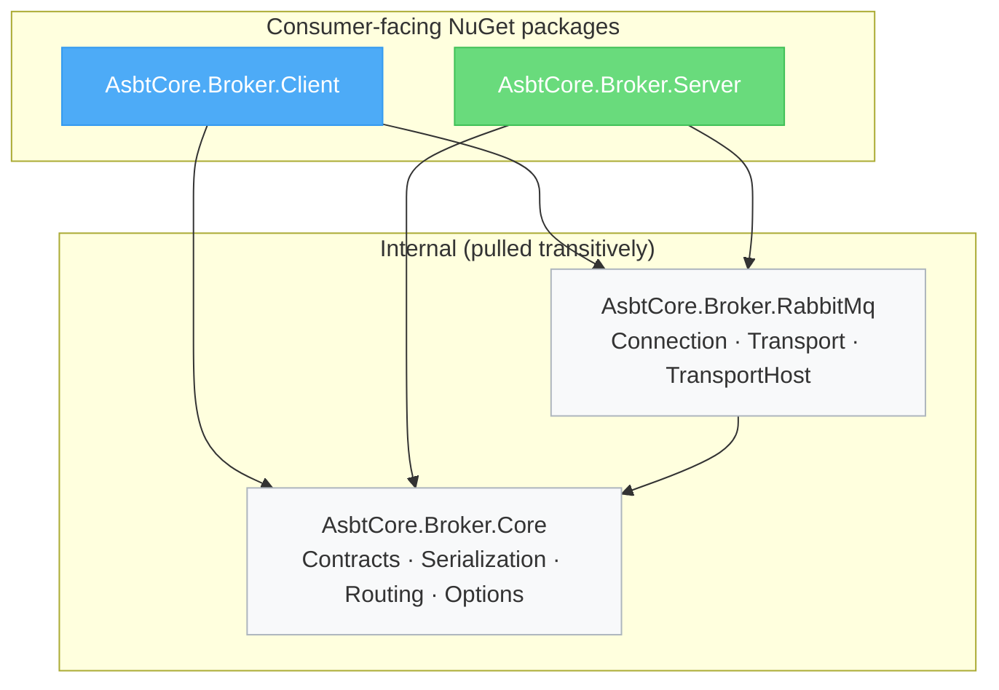
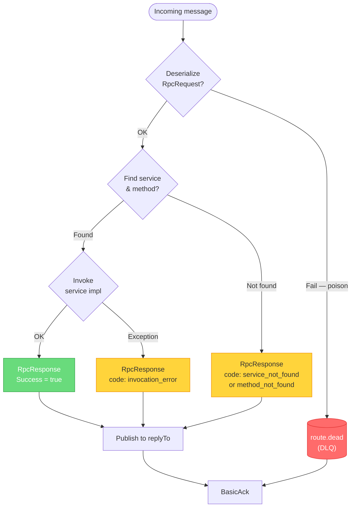
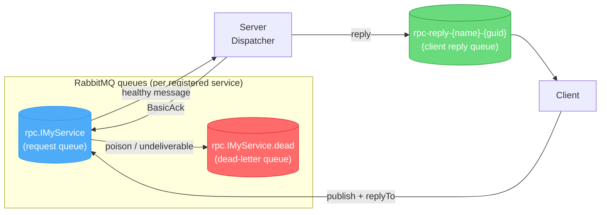
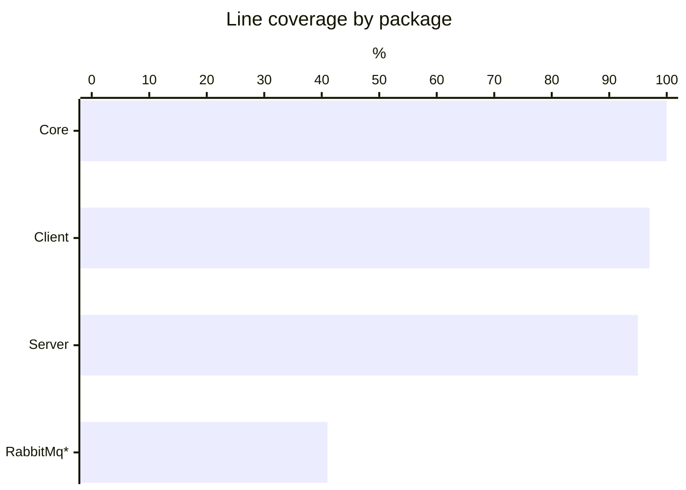
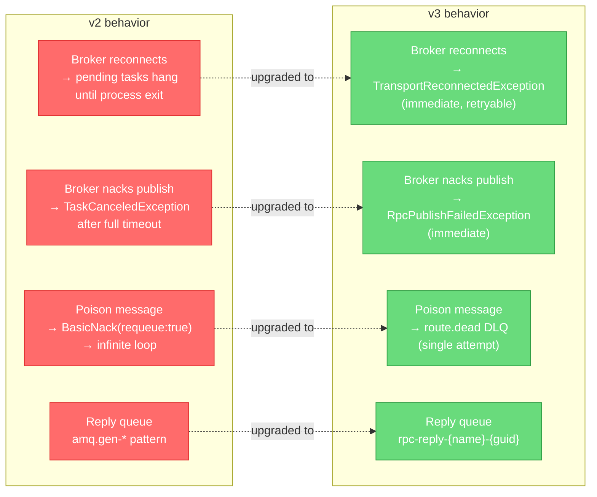

# AsbtCore.Broker — RabbitMQ RPC

[Русская версия](README.ru.md)

A lightweight RPC framework on top of RabbitMQ for .NET 10: type-safe contracts via C# interfaces, DI integration on client and server, JSON serialization, reply-queue pattern, publisher confirms, per-route dead-letter queues.

This repository ships two consumer-facing NuGet packages: **`AsbtCore.Broker.Client`** and **`AsbtCore.Broker.Server`**. Everything else (`Core`, `RabbitMq`) is pulled in transitively.

---

## Installation

**Client app** (calls remote services):

```bash
dotnet add package AsbtCore.Broker.Client
```

**Server app** (hosts implementations):

```bash
dotnet add package AsbtCore.Broker.Server
```

**Shared contracts project** — a plain class library with interfaces and DTOs, referenced by both sides. No `AsbtCore.Broker.*` reference needed there.

---

## Package structure



| Package | Contents |
|---|---|
| `AsbtCore.Broker.Core` | `RpcRequest/Response`, `IRpcTransport`, `IRpcSerializer`, `IRpcRouteResolver`, `RpcOptions`, `RpcRemoteException`, `StableTypeName` |
| `AsbtCore.Broker.RabbitMq` | `RabbitMqRpcTransport` (client-side), `RabbitMqRpcTransportHost` (server-side), `IRabbitMqConnectionProvider` |
| `AsbtCore.Broker.Client` | `RpcClient`, `RpcProxyFactory` (`DispatchProxy`), DI: `AddRabbitRpcClient` / `AddRpcProxy<T>` |
| `AsbtCore.Broker.Server` | `RpcServerBuilder`, `RpcServerRegistry`, `RpcRequestDispatcher`, `RpcServerHostedService`, DI: `AddRabbitRpcServer` |

---

## Architecture

### RPC call flow

```mermaid
sequenceDiagram
    participant App  as Client App
    participant Px   as RpcDispatchProxy
    participant RC   as RpcClient
    participant MQ   as RabbitMQ
    participant Host as RpcServerHostedService
    participant D    as RpcRequestDispatcher
    participant Impl as ServiceImpl

    App  ->> Px   : IMyService.AddAsync(a, b)
    Px   ->> RC   : InvokeProxy(interfaceType, method, args)
    RC   ->> MQ   : BasicPublish(RpcRequest)<br/>routingKey = rpc.IMyService<br/>replyTo = rpc-reply-{name}-{guid}

    MQ   ->> Host : Deliver to request queue
    Host ->> D    : DispatchAsync(RpcRequest)
    D    ->> Impl : AddAsync(a, b)
    Impl -->> D   : result
    D    -->> Host: RpcResponse { Success=true, Result }

    Host ->> MQ   : BasicPublish(RpcResponse)<br/>routingKey = replyTo<br/>correlationId = requestId
    MQ   -->> RC  : Deliver reply
    RC   -->> Px  : deserialized result
    Px   -->> App : Task&lt;int&gt; resolved
```

### Solution layout

```
RabbitMq.RPC/
├─ AsbtCore.Broker.Core/          core contracts & serialization
├─ AsbtCore.Broker.RabbitMq/      RabbitMQ.Client transport layer
├─ AsbtCore.Broker.Client/        proxy factory & DI extensions
├─ AsbtCore.Broker.Server/        dispatcher, registry & hosted service
└─ Tests/
   ├─ AsbtCore.Broker.Core.Tests/          45 tests  (TUnit + Moq)
   └─ AsbtCore.Broker.ClientServer.Tests/  38 tests  (TUnit + Moq)
```

---

## Configuration (`RpcOptions`, section `RabbitMqRpc`)

```json
{
  "RabbitMqRpc": {
    "HostName": "localhost",
    "Port": 5672,
    "VirtualHost": "/",
    "UserName": "guest",
    "Password": "guest",
    "ClientProvidedName": "my-app",
    "RoutePrefix": "rpc.",
    "PrefetchCount": 1,
    "DefaultTimeoutSeconds": 30
  }
}
```

---

## Usage

### 1. Shared contract

```csharp
// MyApp.Contracts.csproj — no broker dependencies
public interface ICalculatorService
{
    Task<int>     AddAsync(int a, int b);
    Task<UserDto> GetUserAsync(Guid id);
}

public sealed record UserDto(Guid Id, string Name);
```

### 2. Server

```csharp
// Program.cs (ASP.NET Core / Worker Service)
using AsbtCore.Broker.Server;

var builder = WebApplication.CreateBuilder(args);

builder.Services
    .AddRabbitRpcServer(builder.Configuration)
    .Register<ICalculatorService, CalculatorService>();

var app = builder.Build();
app.Run();

public sealed class CalculatorService : ICalculatorService
{
    public Task<int>     AddAsync(int a, int b) => Task.FromResult(a + b);
    public Task<UserDto> GetUserAsync(Guid id)  => Task.FromResult(new UserDto(id, "Alice"));
}
```

### 3. Client

```csharp
using AsbtCore.Broker.Client;

var builder = Host.CreateApplicationBuilder(args);

builder.Services
    .AddRabbitRpcClient(builder.Configuration)
    .AddRpcProxy<ICalculatorService>();

var host = builder.Build();

var calc = host.Services.GetRequiredService<ICalculatorService>();
var sum  = await calc.AddAsync(2, 3);               // → 5
var user = await calc.GetUserAsync(Guid.NewGuid()); // → UserDto
```

---

## Error handling



Server-side exceptions are serialized and rethrown on the client as `RpcRemoteException`:

```csharp
try
{
    var result = await calc.AddAsync(1, 2);
}
catch (RpcRemoteException ex)
{
    Console.WriteLine(ex.RemoteExceptionType); // e.g. "System.InvalidOperationException"
    Console.WriteLine(ex.RemoteCode);          // "invocation_error"
    Console.WriteLine(ex.RemoteDetails);       // server stack trace
}
catch (TaskCanceledException)
{
    // DefaultTimeoutSeconds exceeded
}
```

---

## Message reliability & DLQ

Each RPC route gets a companion durable dead-letter queue `{route}.dead`.



Poison messages (malformed payload, unresolvable type, internal dispatcher error) are moved to `*.dead` after a **single attempt** — no infinite requeue loops. Monitor `*.dead` queue depth for alerting.

---

## How to add a new RPC service

1. **Contract** — add interface (`Task` / `Task<T>` methods) + DTOs to the shared `*.Contracts` project.
2. **Server** — implement and register:
   ```csharp
   services.AddRabbitRpcServer(configuration)
           .Register<IMyService, MyServiceImpl>();
   ```
3. **Client** — register a proxy:
   ```csharp
   services.AddRabbitRpcClient(configuration)
           .AddRpcProxy<IMyService>();
   ```
4. Both sides must use the same `RoutePrefix` and interface namespace. Routing key = `RoutePrefix + typeof(T).FullName`.

---

## Testing

Tests use **TUnit** + **Moq** and run without a real RabbitMQ broker.

```bash
dotnet run --project Tests/AsbtCore.Broker.Core.Tests/AsbtCore.Broker.Core.Tests.csproj
dotnet run --project Tests/AsbtCore.Broker.ClientServer.Tests/AsbtCore.Broker.ClientServer.Tests.csproj
```

**83 tests** — 45 in `Core.Tests`, 38 in `ClientServer.Tests`.

Coverage (unit tests only, no real broker):



> \* RabbitMq transport classes (`RabbitMqRpcTransport`, `RabbitMqConnectionProvider`) require a live broker; remaining coverage is integration-test territory.

---

## Requirements

- .NET 10
- RabbitMQ 3.12+ / RabbitMQ.Client 7.x

---

## Migration v2 → v3

v3.0.0 is a reliability-focused release with **breaking wire and behavior changes**. v2.x and v3.x are **not interoperable** — upgrade clients and servers in lockstep.

### Wire-format change

Parameter and result type names on the wire now use the stable form `Namespace.TypeName, AssemblySimpleName`, dropping `Version`, `Culture`, and `PublicKeyToken`. Routine version bumps of contract assemblies no longer break the wire format.

A v2 client **cannot** talk to a v3 server (and vice versa) — the server's method-key lookup will fail with `method_not_found`.

### Behavior changes



### Operator action items

1. Upgrade client and server packages **in lockstep**.
2. Expect new queues `*.dead` per RPC route in your broker — set TTL/max-length policies as needed.
3. Add `catch (TransportReconnectedException)` and/or `catch (RpcPublishFailedException)` where proxy methods are awaited.
4. Update monitoring filters that matched the old `amq.gen-*` reply-queue pattern.
