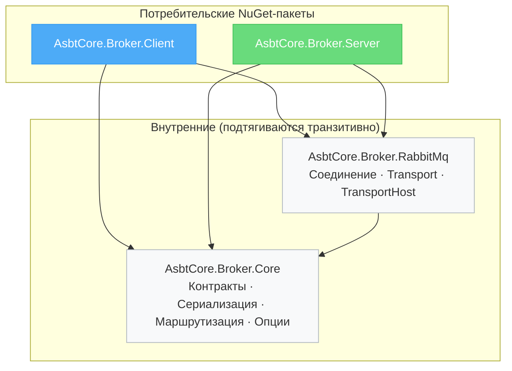
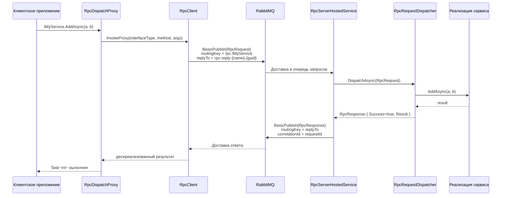
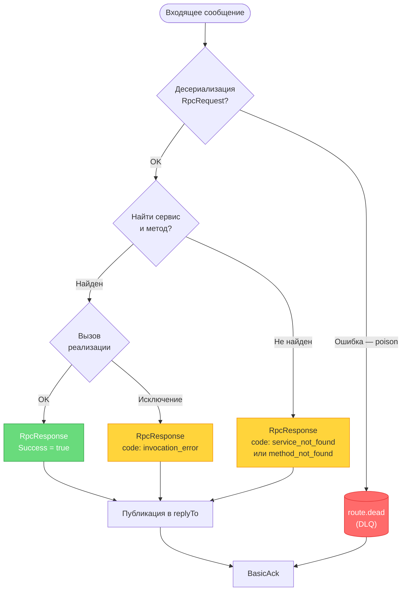
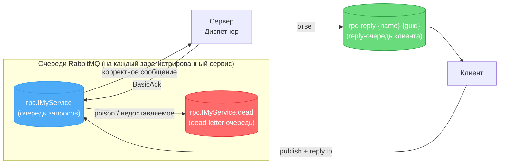
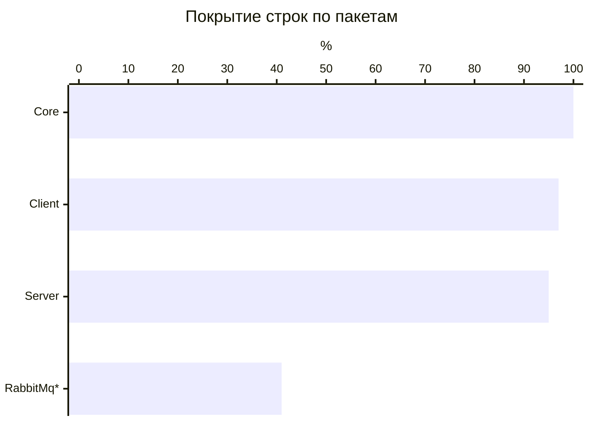
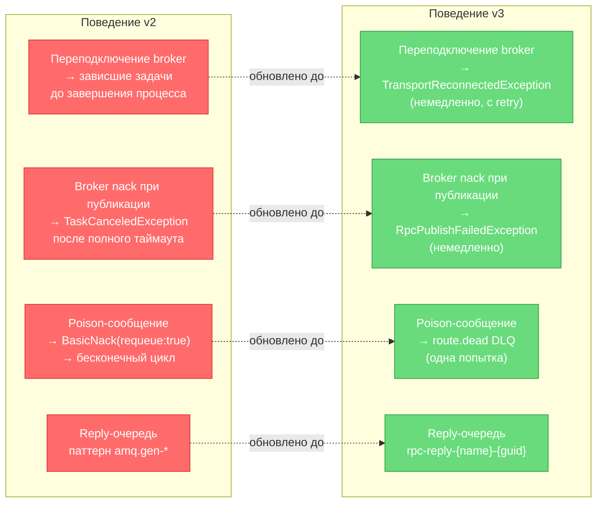

# AsbtCore.Broker — RabbitMQ RPC

[English version](README.md)

Легковесный RPC-фреймворк поверх RabbitMQ для .NET 10: типобезопасные контракты через C#-интерфейсы, DI-интеграция на клиенте и сервере, JSON-сериализация, паттерн reply-queue, publisher confirms, per-route dead-letter очереди.

Репозиторий публикует два потребительских NuGet-пакета: **`AsbtCore.Broker.Client`** и **`AsbtCore.Broker.Server`**. Остальные сборки (`Core`, `RabbitMq`) подтягиваются транзитивно.

---

## Установка

**Клиентское приложение** (вызывает удалённые сервисы):

```bash
dotnet add package AsbtCore.Broker.Client
```

**Серверное приложение** (хостит реализации):

```bash
dotnet add package AsbtCore.Broker.Server
```

**Общий проект контрактов** — обычная class library с интерфейсами и DTO, на неё ссылаются обе стороны. Ссылка на `AsbtCore.Broker.*` в ней не нужна.

---

## Структура пакетов



| Пакет | Содержимое |
|---|---|
| `AsbtCore.Broker.Core` | `RpcRequest/Response`, `IRpcTransport`, `IRpcSerializer`, `IRpcRouteResolver`, `RpcOptions`, `RpcRemoteException`, `StableTypeName` |
| `AsbtCore.Broker.RabbitMq` | `RabbitMqRpcTransport` (клиент), `RabbitMqRpcTransportHost` (сервер), `IRabbitMqConnectionProvider` |
| `AsbtCore.Broker.Client` | `RpcClient`, `RpcProxyFactory` (`DispatchProxy`), DI: `AddRabbitRpcClient` / `AddRpcProxy<T>` |
| `AsbtCore.Broker.Server` | `RpcServerBuilder`, `RpcServerRegistry`, `RpcRequestDispatcher`, `RpcServerHostedService`, DI: `AddRabbitRpcServer` |

---

## Архитектура

### Поток RPC-вызова



### Структура solution

```
RabbitMq.RPC/
├─ AsbtCore.Broker.Core/          базовые контракты и сериализация
├─ AsbtCore.Broker.RabbitMq/      транспортный слой RabbitMQ.Client
├─ AsbtCore.Broker.Client/        фабрика прокси и DI-расширения
├─ AsbtCore.Broker.Server/        диспетчер, реестр и hosted service
└─ Tests/
   ├─ AsbtCore.Broker.Core.Tests/          45 тестов  (TUnit + Moq)
   └─ AsbtCore.Broker.ClientServer.Tests/  38 тестов  (TUnit + Moq)
```

---

## Конфигурация (`RpcOptions`, секция `RabbitMqRpc`)

```json
{
  "RabbitMqRpc": {
    "HostName": "localhost",
    "Port": 5672,
    "VirtualHost": "/",
    "UserName": "guest",
    "Password": "guest",
    "ClientProvidedName": "my-app",
    "RoutePrefix": "rpc.",
    "PrefetchCount": 1,
    "DefaultTimeoutSeconds": 30
  }
}
```

---

## Пример использования

### 1. Общий контракт

```csharp
// MyApp.Contracts.csproj — без зависимостей от broker
public interface ICalculatorService
{
    Task<int>     AddAsync(int a, int b);
    Task<UserDto> GetUserAsync(Guid id);
}

public sealed record UserDto(Guid Id, string Name);
```

### 2. Сервер

```csharp
// Program.cs (ASP.NET Core / Worker Service)
using AsbtCore.Broker.Server;

var builder = WebApplication.CreateBuilder(args);

builder.Services
    .AddRabbitRpcServer(builder.Configuration)
    .Register<ICalculatorService, CalculatorService>();

var app = builder.Build();
app.Run();

public sealed class CalculatorService : ICalculatorService
{
    public Task<int>     AddAsync(int a, int b) => Task.FromResult(a + b);
    public Task<UserDto> GetUserAsync(Guid id)  => Task.FromResult(new UserDto(id, "Alice"));
}
```

### 3. Клиент

```csharp
using AsbtCore.Broker.Client;

var builder = Host.CreateApplicationBuilder(args);

builder.Services
    .AddRabbitRpcClient(builder.Configuration)
    .AddRpcProxy<ICalculatorService>();

var host = builder.Build();

var calc = host.Services.GetRequiredService<ICalculatorService>();
var sum  = await calc.AddAsync(2, 3);               // → 5
var user = await calc.GetUserAsync(Guid.NewGuid()); // → UserDto
```

---

## Обработка ошибок



Исключения сервера сериализуются и пробрасываются на клиенте как `RpcRemoteException`:

```csharp
try
{
    var result = await calc.AddAsync(1, 2);
}
catch (RpcRemoteException ex)
{
    Console.WriteLine(ex.RemoteExceptionType); // напр. "System.InvalidOperationException"
    Console.WriteLine(ex.RemoteCode);          // "invocation_error"
    Console.WriteLine(ex.RemoteDetails);       // стек-трейс сервера
}
catch (TaskCanceledException)
{
    // DefaultTimeoutSeconds превышен
}
```

---

## Надёжность сообщений и DLQ

Каждый RPC-маршрут получает сопутствующую durble dead-letter очередь `{route}.dead`.



Poison-сообщения (неверный payload, нераспознанный тип, внутренняя ошибка диспетчера) перемещаются в `*.dead` **после единственной попытки** — бесконечных циклов requeue нет. Следите за глубиной очереди `*.dead` для алертинга.

---

## Как добавить новый RPC-сервис

1. **Контракт** — добавить интерфейс (`Task` / `Task<T>` методы) + DTO в общий проект `*.Contracts`.
2. **Сервер** — реализовать и зарегистрировать:
   ```csharp
   services.AddRabbitRpcServer(configuration)
           .Register<IMyService, MyServiceImpl>();
   ```
3. **Клиент** — зарегистрировать прокси:
   ```csharp
   services.AddRabbitRpcClient(configuration)
           .AddRpcProxy<IMyService>();
   ```
4. Обе стороны должны использовать одинаковый `RoutePrefix` и namespace интерфейса. Ключ маршрутизации = `RoutePrefix + typeof(T).FullName`.

---

## Тестирование

Тесты используют **TUnit** + **Moq** и запускаются без реального RabbitMQ broker.

```bash
dotnet run --project Tests/AsbtCore.Broker.Core.Tests/AsbtCore.Broker.Core.Tests.csproj
dotnet run --project Tests/AsbtCore.Broker.ClientServer.Tests/AsbtCore.Broker.ClientServer.Tests.csproj
```

**83 теста** — 45 в `Core.Tests`, 38 в `ClientServer.Tests`.

Покрытие (только unit-тесты, без реального broker):



> \* Транспортные классы RabbitMq (`RabbitMqRpcTransport`, `RabbitMqConnectionProvider`) требуют живого broker; оставшееся покрытие — территория интеграционных тестов.

---

## Требования

- .NET 10
- RabbitMQ 3.12+ / RabbitMQ.Client 7.x

---

## Миграция v2 → v3

v3.0.0 — релиз с фокусом на надёжность, содержит **ломающие изменения wire-формата и поведения**. v2.x и v3.x **несовместимы** — обновляйте клиенты и серверы одновременно.

### Изменение wire-формата

Имена типов параметров и результатов теперь используют стабильную форму `Namespace.TypeName, AssemblySimpleName` без `Version`, `Culture` и `PublicKeyToken`. Плановые версионные бампы контрактных сборок больше не ломают wire-формат.

Клиент v2 **не может** общаться с сервером v3 (и наоборот) — поиск ключа метода завершится ошибкой `method_not_found`.

### Изменения поведения



### Действия оператора

1. Обновите пакеты клиента и сервера **одновременно**.
2. Ожидайте появления новых очередей `*.dead` на каждый RPC-маршрут в broker — настройте политики TTL/max-length по необходимости.
3. Добавьте `catch (TransportReconnectedException)` и/или `catch (RpcPublishFailedException)` там, где вы awaite методы прокси.
4. Обновите фильтры мониторинга, которые совпадали со старым паттерном reply-очереди `amq.gen-*`.

---

## Миграция v3.0 → v3.1

- **Серверная диспетчеризация сообщений теперь параллельная по умолчанию.** `RpcOptions.ConsumerDispatchConcurrency` по умолчанию равен `PrefetchCount`. Существующие хендлеры должны быть потокобезопасны. Задайте `RpcOptions.ConsumerDispatchConcurrency = 1`, чтобы вернуть последовательное поведение v3.0.
- В `IRpcTransportHost` добавлен `StopAsync(CancellationToken)` (default interface method). Кастомные транспорты должны переопределить метод, чтобы дренировать in-flight хендлеры перед disposal.
- `IRpcTransportHost.Dispose()` теперь sync-over-async last-resort путь. Предпочитайте `DisposeAsync()` (или disposal через DI).
- `RpcRequest.RequestId` больше не инициализируется автоматически в property initializer. Клиентский код, конструирующий `RpcRequest` напрямую, должен задавать `RequestId` явно.
- Обработка poison reply: `OnResponseReceivedAsync` теперь пробрасывает ошибки десериализации в ожидающий caller вместо тихого логирования и ожидания timeout.
